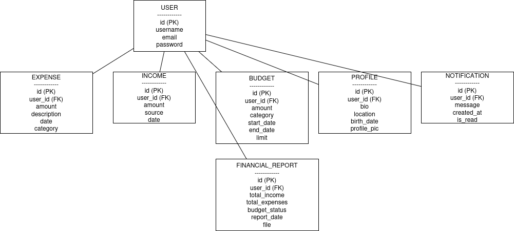

Finance Tracker Technical Documentation
Overview

Finance Tracker is a web application for personal finance management, enabling users to track budgets, income, expenses, financial reports, and profiles. It features a React frontend with Tailwind CSS for a responsive, card-based UI and a Django REST Framework (DRF) backend with SQLite (planned migration to PostgreSQL). Authentication uses JWT (SimpleJWT), and the backend is deployed on Render as a Web Service.

Tech Stack:

Frontend: React, React Router, Tailwind CSS, Axios, react-datepicker, react-icons.

Backend: Django, DRF, SimpleJWT, SQLite, Gunicorn (WSGI), django-cors-headers, python-dotenv, dj-database-url.

Deployment: Render (Web Service for backend, Static Site planned for frontend).

Security: JWT, CORS, environment variables (.env), ALLOWED_HOSTS.

API Documentation: Swagger UI (/swagger/), ReDoc (/redoc/).

Architecture

The application uses a client-server model with a decoupled React frontend and Django backend, communicating via REST API over HTTPS. The backend is served via Gunicorn (WSGI) on Render, with SQLite for data storage.

Frontend: Single-page application (SPA) with React Router for navigation. Tailwind CSS provides a card-based, responsive UI.

Backend: DRF exposes REST endpoints (/api/budgets/, /api/incomes/, /api/expenses/, etc.). Gunicorn handles HTTP requests via WSGI.

Database: SQLite (db.sqlite3) stores data, with ephemeral storage on Render (resets on redeploy).

Authentication: JWT tokens are stored in localStorage and sent in Authorization: Bearer headers.

<h1>Frontend Details</h1>

The frontend (react-cards-app) is a React SPA defined in src/App.jsx. It uses React Router for navigation and Tailwind CSS for styling.

Routing (App.jsx)

Router: BrowserRouter wraps the app, with routes defined in <Routes>.

Sidebar: Displays for all pages except /signin and /signup, using react-icons (FiHome, FiDollarSign, etc.) and Tailwind CSS. Links to:

/dashboard (DashboardPage)

/budget (BudgetPage)

/income (IncomePage)

/expenses (ExpensesPage)

/financialreport (FinancialReportPage)

/profile (ProfilePage)

Default Route: Redirects / to /signup.

Header: Shows the active component name and user info (hardcoded "John Doe") for non-auth pages.

Styling: Gray background (bg-gray-100), white sidebar (bg-white), blue accents (bg-blue-600), card-based main content (bg-gray-200).

Key Components

DashboardPage.jsx: [Assumed] Displays summary of budgets, income, and expenses.

BudgetPage.jsx: Fetches and manages budgets via /api/budgets/. Uses BudgetList.jsx for display, BudgetForm.jsx for input, Tailwind CSS for cards, and react-spinners for loading.

IncomePage.jsx: [Assumed] Manages income via /api/incomes/. Includes IncomeForm.jsx with react-datepicker and green buttons.

ExpensesPage.jsx: [Assumed] Manages expenses via /api/expenses/. Includes ExpenseForm.jsx with category dropdown and indigo buttons.

FinancialReportPage.jsx: [Assumed] Displays financial reports via /api/financial-report/.

ProfilePage.jsx: [Assumed] Manages user profile via /api/profiles/.

Signin.jsx/Signup.jsx: Authentication pages with Tailwind-styled forms.

State Management: Local state via useState (e.g., activeComponent in App.jsx, form inputs in IncomeForm.jsx).

<h1>Backend Details</h1>

The backend (FinanceTrackerApi) is a Django project with a FinanceApp app, using DRF for API endpoints and SimpleJWT for authentication.

Models (FinanceApp/models.py)

User: Django’s built-in auth.User model.

Expense:

Fields: user (FK), amount (Decimal), description (Text), date (Date), category (Char).

Income:

Fields: user (FK), amount (Decimal), source (Char), date (Date).

Budget:

Fields: user (FK), amount (Decimal), category (Char, choices: Income/Expense/Savings), start_date (Date), end_date (Date), limit (Float).

FinancialReport:

Fields: user (FK), total_income (Decimal), total_expenses (Decimal), budget_status (Decimal), report_date (Date), file (File, PDF).

Methods: calculate_report (computes totals), generate_report_file (creates PDF using ReportLab).

Profile:

Fields: user (OneToOne), bio (Text), location (Char), birth_date (Date), profile_pic (Image).

Signals: Auto-creates/saves profile on user creation.

Notification:

Fields: user (FK), message (Text), created_at (DateTime), is_read (Boolean).

Views (FinanceApp/views.py)

RegistrationView: Handles user registration (/api/register/). Returns JWT tokens (access/refresh).

UserViewSet: CRUD for User model (/api/users/).

ExpenseViewSet: CRUD for Expense model (/api/expenses/). Filters by authenticated user, validates amount > 0.

IncomeViewSet: CRUD for Income model (/api/incomes/). Assigns authenticated user via serializer context.

BudgetViewSet: CRUD for Budget model (/api/budgets/). Validates dates, amount, limit; creates notifications if amount > limit.

FinancialReportListCreateAPIView: Lists/creates reports (/api/financial-report/). Calls calculate_report on POST.

FinancialReportDetailAPIView: Retrieves/deletes reports (/api/financial-report/<id>/). Serves PDF files.

ProfileViewSet: CRUD for Profile model (/api/profiles/). Filters by authenticated user.

NotificationListView: Lists notifications (/api/notifications/). Filters by user, ordered by created_at.

Serializers (FinanceApp/serializers.py)

RegisterSerializer: Validates and creates User (username, email, password).

UserSerializer: Serializes User fields.

ExpenseSerializer: Serializes Expense, user read-only.

IncomeSerializer: Serializes Income, user read-only, handles create/update.

BudgetSerializer: Serializes Budget, user read-only.

FinancialReportSerializer: Serializes FinancialReport, calls calculate_report on create.

ProfileSerializer: Serializes Profile, user read-only.

NotificationSerializer: Serializes Notification, user read-only.

URLs (FinanceTrackerApi/urls.py)

Router: DRF DefaultRouter for /api/users/, /api/expenses/, /api/incomes/, /api/budgets/, /api/profiles/.

Custom Paths:

/api/token/: JWT token generation.

/api/token/refresh/: Token refresh.

/api/register/: User registration.

/api/financial-report/: Report list/create.

/api/financial-report/<id>/: Report detail/delete.

/api/notifications/: Notification list.

/swagger/, /redoc/: API documentation.

<h1>Deployment<h1>

The backend is deployed on Render as a Web Service with SQLite (ephemeral storage).

WSGI Configuration

Gunicorn: WSGI server, binds to 0.0.0.0:10000 on Render. Configured in Procfile:

web: gunicorn FinanceTrackerApi.wsgi:application

wsgi.py: Located at FinanceTrackerApi/wsgi.py, provides the application callable for Gunicorn to serve Django.

build.sh: Pre-deployment script:

#!/bin/bash
python manage.py collectstatic --noinput
python manage.py migrate

collectstatic: Copies static files to staticfiles/ for serving.

migrate: Applies migrations to SQLite.

Render Setup

Web Service:

Repository: finance-tracker-backend.

Branch: main.

Root Directory: Empty (backend files in repo root).

Build Command: pip install -r requirements.txt && ./build.sh.

Start Command: gunicorn FinanceTrackerApi.wsgi:application.

Instance Type: Free.

Environment Variables:

DJANGO_SECRET_KEY: Secure key from .env.

DEBUG: False.

PYTHON_VERSION: 3.11.

SQLite: Uses db.sqlite3, resets on redeploy. Migrations run via build.sh.

ALLOWED_HOSTS: ['localhost', '127.0.0.1', 'finance-tracker-backend-8j8x.onrender.com'].

CORS: Allows http://localhost:5173, https://finance-tracker-frontend.onrender.com.

Sequence Diagram for Budget Creation:

<h1>Security<h1>

JWT Authentication: SimpleJWT generates tokens at /api/token/. Stored in localStorage, sent in Authorization: Bearer headers.

CORS: django-cors-headers restricts origins to http://localhost:5173, https://finance-tracker-frontend.onrender.com.

Environment Variables: DJANGO_SECRET_KEY in .env locally, Render dashboard in production.

ALLOWED_HOSTS: Explicitly set to prevent DisallowedHost errors.

Input Validation: Serializers and views validate data (e.g., amount > 0, date formats).

Future Improvements

Database: Migrate to PostgreSQL for persistent storage.

Frontend: Add error boundaries, toast notifications, and Redux for state management.

Backend: Optimize queries with indexing, add caching (e.g., Redis).

Security: Implement refresh token rotation, secure cookies for JWT, and rate limiting.

Deployment: Automate CI/CD with GitHub Actions.

